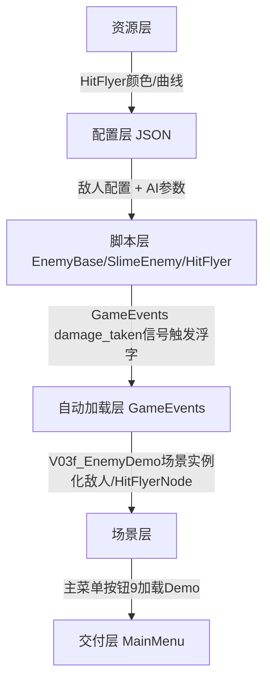

# 迭代3(V0.3f) 详细设计文档 - 敌人AI与伤害浮字
> 文档位置：doc/迭代3(V0.3f)详细设计文档_敌人AI与伤害浮字.md
> 目标版本：V0.3f （总V0.3第6个小迭代，2/5组）
> 父设计：doc/迭代3(V0.3)详细设计文档_角色战斗实装.md §2.1 + §3.1 + §3.3

---

## 0. 迭代目标（用户可感知功能 ✅）
| # | 用户看到的功能 | 主菜单入口 |
|---|---|---|
| ✅F1 | **敌人4态AI FSM**：巡逻(PATROL绿)→发现玩家追击(CHASE橙)→攻击范围内挥拳(ATTACK红)→超出范围归位(RETREAT紫) | 主菜单第9个橙色按钮 ⚔ V0.3f 敌人AI实战 |
| ✅F2 | **伤害浮字 HitFlyer**：受击点喷出 `-18白/-暴击58黄/背刺36红`，向上漂浮0.9秒淡出 | 演示场景玩家/敌人互砍时立即显示 |
| ✅F3 | **受击闪红特效**：角色hp扣减瞬间body涂红0.08s | 玩家/敌人受击立即视觉反馈 |
| ✅F4 | **AI状态色卡**：右上角展示当前敌人AI的色卡（绿/橙/红/紫）+文字 | V0.3f演示场景UI |

---

## 1. 6层架构依赖（自下而上）

- **单向依赖**：Demo→EnemyBase→CharacterBase→GameEvents（不反向）
- **OneTrack不破坏**：EnemyBase/HitFlyer为新文件，CharacterBase只追加方法不删旧字段

---

## 2. 脚本层设计

### 2.1 EnemyBase.gd 敌人AI FSM基类（继承CharacterBase）
文件：`scripts/characters/EnemyBase.gd` class_name:EnemyBase

#### 2.1.1 FSM4态枚举（内部AI状态，区别角色FSM state）
```gdscript
enum EnemyAIState { PATROL=0, CHASE=1, ATTACK=2, RETREAT=3 }
```
合法转换：`{PATROL:[0,1,3], CHASE:[0,1,2,3], ATTACK:[0,1,2,3], RETREAT:[0,1,3]}`

#### 2.1.2 字段追加（CharacterBase不动，字段全声明在EnemyBase）
| 字段 | 类型 | 默认 | 含义 |
|---|---|---|---|
| enemy_ai_state | int | EnemyAIState.PATROL | 当前AI状态 |
| patrol_left / patrol_right | float | global_pos.x±80 | 巡逻左右边界 |
| chase_trigger | float | 150 | 触发追击半径 |
| attack_range | float | 60 | 攻击范围 |
| retreat_radius | float | 360 | 超出归位半径 |
| home_pos | Vector2 | 初始位置 | 出生点（RETREAT目标） |
| patrol_dir | float | ±1.0 | 巡逻方向 |
| attack_cd_left | float | 0 | 攻击冷却 |
| state_timer | float | 0 | 本AI状态停留秒数 |

#### 2.1.3 核心流程 `ai_decision_tick(delta)`
```
1. state_timer++
2. attack_cd_left = max(0, attack_cd_left-delta)
3. 搜索玩家：get_tree().get_nodes_in_group("player") 最近1个
4. 如果玩家距离 < attack_range 且 cd==0 → ATTACK → _do_attack(玩家)
   否则如果玩家距离 < chase_trigger → CHASE → 向玩家移动
   否则如果超出 retreat_radius → RETREAT → 向home_pos移动
   否则 → PATROL → 左右巡逻（触边界反转）
```

#### 2.1.4 `take_damage()` 追加受击闪红
```gdscript
# 在 take_damage 结束处追加：
flash_time = 0.08
queue_redraw()
```
字段：`var flash_time: float = 0.0`
在`_draw()`开头：
```gdscript
func _draw() -> void:
    if flash_time > 0.0:
        draw_rect(Rect2(-18,-2,36,32), Color(1,0.2,0.2,0.45), true)
```
在`_physics_process`末尾：`if flash_time>0: flash_time-=delta; queue_redraw()`

---

### 2.2 SlimeEnemy.gd 具体史莱姆敌人（图形化，继承EnemyBase）
文件：`scripts/characters/SlimeEnemy.gd`
- `_draw()`：绿色身体(圆+眼睛) + 攻击时绿色弧线 + 闪红
- kind = ENEMY, collision_layer = 4, collision_mask = 1|2
- weapon = {atk_mult=1.0, cd_sec=1.1, knockback=90, range=58, damage_type="physical"}

---

### 2.3 HitFlyer 伤害浮字（无资源RefCounted，无场景纯Draw）
文件：`scripts/combat/HitFlyer.gd` class_name:HitFlyer extends Node2D

#### 2.3.1 字段
```gdscript
var text: String = "-18"
var color: Color = Color.WHITE
var life: float = 0.9
var age: float = 0.0
var offset: Vector2 = Vector2(0,0)
var rise_speed: float = 55.0
```

#### 2.3.2 `_process(delta)` + `_draw()`
```
_process(delta):
    age += delta
    if age >= life: queue_free()
    offset.y -= rise_speed * delta
    queue_redraw()

_draw():
    var alpha = clamp(1.0 - age/life, 0.0, 1.0)
    var col = Color(color.r, color.g, color.b, alpha)
    # 描边(黑) + 字（两叠字模拟阴影）
    var f := ThemeDB.fallback_font
    var font_size := 22
    draw_string(f, Vector2(1, 1)+offset, text, HORIZONTAL_ALIGNMENT_CENTER, -1, font_size, Color(0,0,0,alpha*0.9))
    draw_string(f, offset, text, HORIZONTAL_ALIGNMENT_CENTER, -1, font_size, col)
```

#### 2.3.3 工厂静态函数 `spawn(parent: Node2D, pos: Vector2, dmg: int, crit: bool, backstab: bool)`
```gdscript
static func spawn(parent: Node2D, pos: Vector2, dmg: int, crit: bool, backstab: bool) -> HitFlyer:
    var hf := HitFlyer.new()
    if backstab:
        hf.text = "背刺%d" % dmg
        hf.color = Color(1.0, 0.25, 0.35)
    elif crit:
        hf.text = "-暴击%d" % dmg
        hf.color = Color(1.0, 0.92, 0.3)
    else:
        hf.text = "-%d" % dmg
        hf.color = Color.WHITE
    hf.global_position = pos
    parent.add_child(hf)
    return hf
```

---

### 2.4 GameEvents战斗信号挂钩（修改CharacterBase.take_damage）
文件：`scripts/editor/CharacterBase.gd` → take_damage末尾追加（不破坏已有）：
```gdscript
# 发射 damage_taken：触发HitFlyer
if get_tree() != null and is_inside_tree():
    var ge: Node = get_tree().root.get_node_or_null("GameEvents")
    if ge != null and ge.has_signal("damage_taken"):
        ge.emit_signal("damage_taken", self, float(dmg_amount), bool(is_crit), bool(is_backstab))
```
GameEvents.gd 需定义 damage_taken 信号（若不存在则追加，兼容旧版）

---

## 3. 场景层设计

### 3.1 V03f_EnemyDemo 演示场景（scenes/test/）
UI（_ready动态创建，不依赖外部资源）：
| UI | 坐标 | 内容 |
|---|---|---|
| 标题Label | (40,20) 42号橙字 | V0.3f 敌人AI + 伤害浮字 演示 |
| 操作提示Label | (40,60) | A/D移动, Space跳, J攻击, K格挡 ←→ 敌人绿→橙→红→紫AI循环 |
| 玩家HP条ProgressBar | (40,90) 260×18 | HP: %d/%d 颜色蓝 |
| 敌人HP条ProgressBar | (40,118) 260×18 | 敌人HP: %d/%d 颜色红 |
| 玩家状态卡 | (900, 28) | 蓝色玩家色卡(HP/J) |
| AI状态色卡(敌人) | (900, 72) 180×40 | 绿(巡逻)/橙(追击)/红(攻击)/紫(归位)+文字 |
| 浮字Parent(HitFlyerLayer) | 根 | 用于add_child HitFlyer |

节点结构：
```
V03f_EnemyDemo (Node2D)
├── Ground (StaticBody2D 地板 y=580)
├── PlayerNode (PlayerBase实例 at x=300)
├── SlimeEnemyNode (SlimeEnemy实例 at x=820, home=820)
├── HitFlyerLayer (Node2D, 伤害浮字容器)
└── CanvasLayer(UI): 所有ProgressBar/Label/色卡
```
GameEvents.damage_taken → Demo脚本连接 → 调用 HitFlyer.spawn(HitFlyerLayer, 受击者.global_pos + Vector2(0,-45), dmg, crit, backstab)

### 3.2 主菜单MainMenu第9按钮
按钮9：橙色 `⚔ V0.3f 敌人AI实战` → `get_tree().change_scene_to_file("res://scenes/test/V03f_EnemyDemo.tscn")`

---

## 4. 测试层（10UC无桩Headless）
文件：`scripts/test/V03f_EnemyTest.gd` + runner_v03f.gd

| # | 用例 | 断言 |
|---|---|---|
| T1 | SlimeEnemy实例化 kind=ENEMY | kind==3, cl==4 |
| T2 | setup_enemy(home=820) 写入hp/atk/chase | max_hp=100, atk=10, chase=150 |
| T3 | 玩家距离<chase → AI CHASE(橙) | _set_ai返回OK, state=1 |
| T4 | 玩家距离<attack_range且cd=0 → ATTACK(红) | state=2 |
| T5 | attack_cd_left > 0 → 不重复挥 | state保持0 |
| T6 | 超出retreat_radius → RETREAT(紫) | state=3, _move_toward velocity |
| T7 | PATROL巡逻 dir反转 | patrol_dir从1→-1（越界） |
| T8 | HitFlyer.spawn 白字 `-18` (普通) | text="-18", color.WHITE |
| T9 | HitFlyer.spawn 黄字 `-暴击58` (暴击) | text含暴击, color黄 |
| T10 | EnemyBase.take_damage → hp减少 + flash_time>0 | hp<原hp, flash>0 |

---

## 5. 交付顺序与OneTrack
- EnemyBase / SlimeEnemy / HitFlyer：**新文件，不碰旧脚本**（CharacterBase仅追加可选信号发射）
- 主菜单按钮9追加：MainMenu数组长度+1，旧按钮0-8保留索引不变
- 测试：V03b/V03c/V03d/V03e/V03f 所有Runner必须Result passed
- 验收：run_game启动游戏 → 主菜单1-9按钮均能进入对应Demo不崩溃

---

## 6. 文件清单（本次新增/修改）
| 类型 | 文件 | 动作 |
|---|---|---|
| 脚本 | scripts/characters/EnemyBase.gd | 新增 |
| 脚本 | scripts/characters/SlimeEnemy.gd | 新增 |
| 脚本 | scripts/combat/HitFlyer.gd | 新增 |
| 脚本 | scripts/editor/CharacterBase.gd | take_damage追加damage_taken信号 + flash_time |
| 场景 | scenes/test/V03f_EnemyDemo.tscn | 新增 |
| 脚本 | scenes/test/V03f_EnemyDemo.gd | 新增 |
| UI | scenes/main_menu/MainMenu.gd/.tscn | 第9按钮追加 |
| 测试 | scripts/test/V03f_EnemyTest.gd + runner_v03f.gd | 新增 |
| 文档 | doc/迭代3(V0.3f)详细设计文档_敌人AI与伤害浮字.md | 新增 |
| 手册 | doc/V0.3f用户手册_敌人AI与伤害浮字.md | 新增 |

---

## 7. Godot_v4.6开发原则（继承自V0.3计划追加）
见V0.3总体计划末尾26条，严格遵守不再重复。
